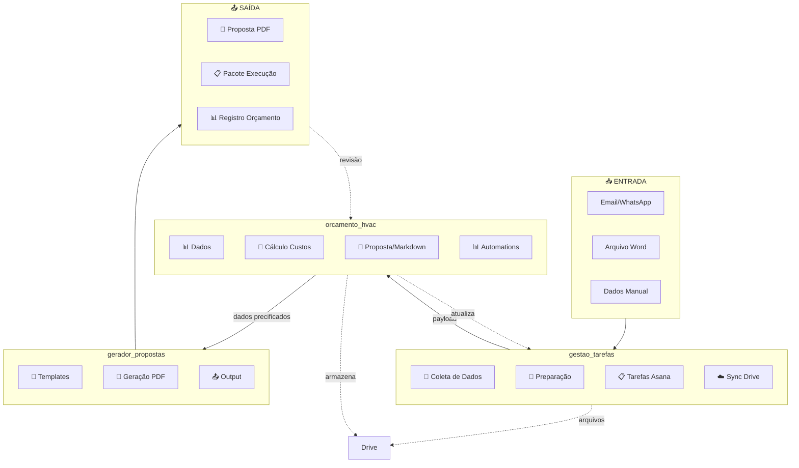
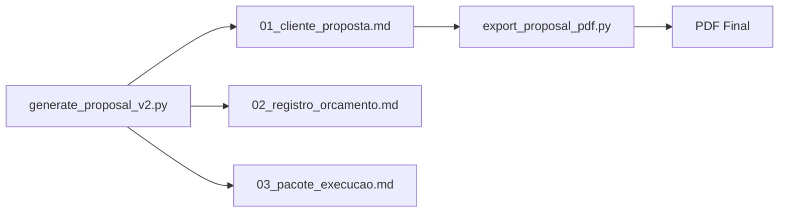

# Sistema de Orçamento HVAC - Fluxo de Dados



---

## Descrição do Fluxo

### 1. Entrada (Coleta)
- **Email/WhatsApp**: Mensagens de clientes
- **Arquivo Word**: Propostas manuais anteriores
- **Dados Manual**: Entrada direta do orçamentista

### 2. gestao_tarefas
- **Coleta**: Extrai dados de emails/mensagens
- **Preparação**: Limpa e estrutura dados
- **Tarefas Asana**: Cria workflow de orçamento
- **Sync Drive**: Sincroniza documentos

### 3. orcamento_hvac
- **Dados**: Catálogos (materiais, composições, etc)
- **Cálculo**: Aplica custos + markups
- **Proposta**: Gera documentos Markdown
- **Automations**: Scripts de geração (v2, etc)

### 4. gerador_propostas
- **Templates**: Layout visual (HTML/CSS)
- **Geração PDF**: Converte para PDF profissional
- **Output**: Arquivos finais

---

## Arquivos de Integração

| De | Para | Arquivo |
|----|------|---------|
| orcamento_hvac | gerador_propostas | `automations/scripts/export_proposal_pdf.py` |
| gestao_tarefas | orcamento_hvac | `automations/scripts/integrate_gestao_orcamentos_v1.py` |

---

## Formato de Dados Entre Módulos

```json
// Payload: orcamento_hvac → gerador_propostas
{
  "projeto": "Expansão Chiller Bloco C",
  "cliente": "Hospital Vida Sul",
  "itens_precificados": [...],
  "resumo_financeiro": { "valor_total": 665073.53 }
}
```

---

## Fluxo Detalhado (Automations)


